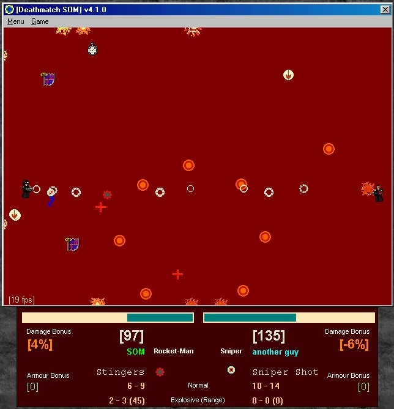



## DeathMatch SOM

### Description

Chose your Class, your weapons (16 to chose from!), and battle it out to the death with a friend or the AI. Also features Powerups, which can do anything from boost your armour, weaken your enemy, or even unleash a deadly ring of pipebombs to destroy your opponent. The game even has sounds for everything, so you can actually hear when you hit your opponent, or when a powerup appears.

But the best part is, this code is *highly customisable*. You can add new weapons, new powerups, and new classes without having to change any code at all! You can quite easily make your own game by drawing your own pictures, recording your own sounds, and making your own settings file. You can even change the skins of the players: just draw your character, name the bmp files appropriately, and select 'Change Skins' from the menu. There's even a half-completed help file to get you started with the game (I haven't linked it to the program though. Sorry.)

Well what are you waiting for? Download it :)
 
### More Info
 

             |
---                |---
**Submitted On**   |2002-05-01 18:18:58
**By**             |[Somma\!](https://github.com/Planet-Source-Code/PSCIndex/blob/master/ByAuthor/somma.md)
**Level**          |Intermediate
**User Rating**    |4.2 (25 globes from 6 users)
**Compatibility**  |VB 5\.0, VB 6\.0
**Category**       |[Games](https://github.com/Planet-Source-Code/PSCIndex/blob/master/ByCategory/games__1-38.md)
**World**          |[Visual Basic](https://github.com/Planet-Source-Code/PSCIndex/blob/master/ByWorld/visual-basic.md)
**Archive File**   |[DeathMatch78409522002\.zip](https://github.com/Planet-Source-Code/somma-deathmatch-som__1-34336/archive/master.zip)

